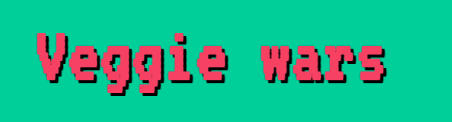

# veggie-wars-game

This game was created as part of the web development bootcamp at Ironhack

## Description

The use have to avoid the animal products to increase score. If an animal product touches the plate, then triggers the game over screen.

## MVP

Basic functionalities, just chiken pieces falling from the top of the canvas, the game is over when an animal product touches the plate. 

## Backlog

- [x] Adding more items to fall from the sky, such as ham
- [x] Adding other items that will increase the score, such as Avocado or Hummus
- [x] Adding different gravity to the products
- [x] Changing the name of the level as the score increases (level 1: dinner with friends, level 2: christmas, level 3 : bbq)
- [x] Adding background music and sound effects

## Data structure

- src folder: 
    - index.html will hold all the html
    - index.css will hold all the styling
    - index.js will hold all the javascript
    - variables.js will hold all the variables

- images folder will hold all the images
- music folder will have all the sound effects and music

## Resources

[Kanban board](https://www.notion.so/martagigu/9170f2e918354e8ea7f57573e6d6dac2?v=f2868bf3eda940c69885163f577f592c)
